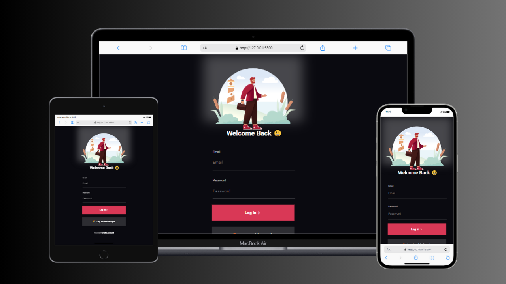

<h1>:walking: Tela de Login :bike:</h1>
 

 

Projeto proposto no módulo Clube do Portfólio, do Dev Club. Neste projeto fiz uso das tecnologias HTML e CSS, além da ferramenta FIGMA para desenvolver duas páginas, uma de Login e outra de Signup.

 

<h2>Tecnologias utilizadas:</h2>

- 

- 

- 
 

<h2>Curiosidades:</h2>

Neste projeto descobri uma nova ferramenta, um banco de dados para utilizar alguns símbolos em meu projeto, no site https://boxicons.com/

